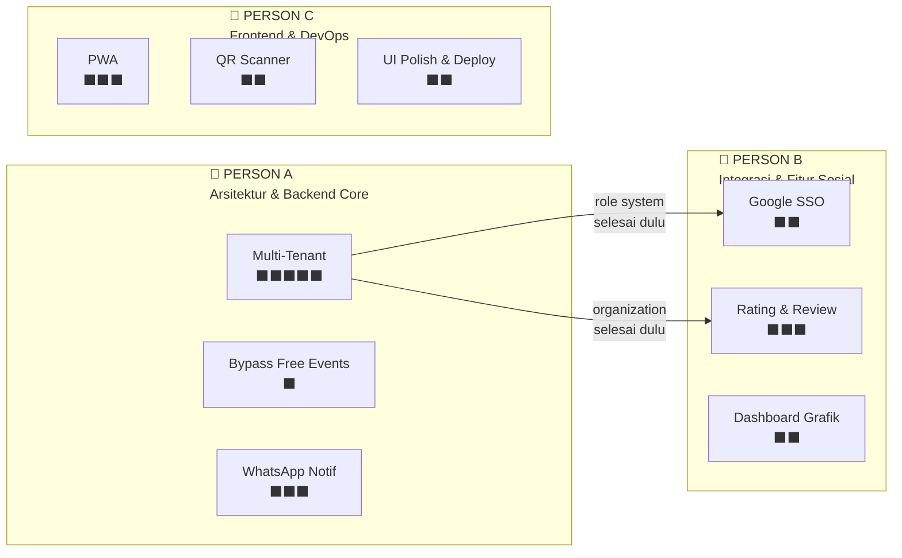
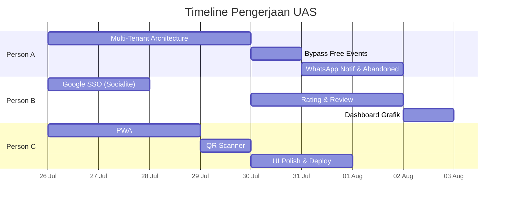

# 📋 Pembagian Jobdesk UAS — Amikom Event Hub
**Tim: 3 Orang** | **Total Fitur: 8** (3 Wajib + 5 Pilihan)

---

## Overview Pembagian



---

## 👷 PERSON A — Arsitektur & Backend Core

**Fokus**: Fondasi arsitektur multi-tenant & backend integrations

### Fitur yang Dikerjakan

| # | Fitur | Tipe | Bobot |
|---|-------|------|-------|
| 1 | **Multi-Tenant (Multi Organisasi)** | Wajib | ⬛⬛⬛⬛⬛ Besar |
| 2 | **Bypass Free Events** | Pilihan (Bonus) | ⬛ Kecil |
| 3 | **WhatsApp Notification & Abandoned Cart** | Pilihan | ⬛⬛⬛ Sedang |

### Detail Task

#### 🔴 Fase 1: Multi-Tenant Architecture (PRIORITAS UTAMA — dikerjakan pertama!)

> [!IMPORTANT]
> Fitur ini harus selesai **paling awal** karena Person B bergantung pada role system & model Organization yang dibuat di sini.

- [ ] Buat migration `create_organizations_table` (name, slug, description, logo_path, owner_id, is_verified)
- [ ] Buat migration `add_organization_id_to_events_table`
- [ ] Buat migration `update_users_role_for_multitenant` (rename admin→superadmin, tambah organizer)
- [ ] Buat model `Organization.php` + relasi
- [ ] Update model `User.php` — tambah relasi, helpers `isOrganizer()`, `isSuperAdmin()`
- [ ] Update model `Event.php` — tambah `organization_id`, relasi `belongsTo(Organization)`
- [ ] Buat `OrganizerMiddleware.php`
- [ ] Update `AdminMiddleware.php` — hanya superadmin
- [ ] Buat controller `Organizer/OrganizerController.php` — dashboard, CRUD events (scoped per organisasi)
- [ ] Buat controller `RegisterOrganizerController.php` — form daftar organisasi
- [ ] Tambah halaman admin: list organisasi + approve/reject
- [ ] Buat views `organizer/` (dashboard, events CRUD, profil organisasi)
- [ ] Buat layout `layouts/organizer/organizer.blade.php`
- [ ] Update `routes/web.php` — group organizer + route daftar organisasi
- [ ] Update admin dashboard — link ke manajemen penyelenggara
- [ ] Update event detail & homepage — tampilkan nama organisasi

#### 🟢 Fase 2: Bypass Free Events

- [ ] Modifikasi `PaymentController@process` — if `price_value == 0`: skip Midtrans, langsung Success + generate ticket_code + decrement stock
- [ ] Modifikasi `PaymentController@create` — ubah label tombol jadi "Daftar Gratis" jika harga 0
- [ ] Update `checkout/create.blade.php` — sembunyikan komponen Midtrans jika gratis

#### 🟡 Fase 3: WhatsApp Notification & Abandoned Cart

- [ ] Setup akun Fonnte + dapatkan API token
- [ ] Buat `config/fonnte.php`
- [ ] Buat service `App\Services\WhatsAppService.php` — method `sendMessage($phone, $message)`
- [ ] Modifikasi `PaymentController@callback` — kirim WA setelah pembayaran Success (link E-Ticket)
- [ ] Buat Artisan command `AbandonedCartReminder.php` — cari Pending > 1 jam, kirim WA reminder + link bayar
- [ ] Schedule command di `routes/console.php` — jalankan setiap 30 menit

### Deliverables
- ✅ Sistem role 3-tier (user/organizer/superadmin) berfungsi
- ✅ Organizer bisa register, disetujui superadmin, lalu kelola event sendiri
- ✅ Event gratis langsung sukses tanpa Midtrans
- ✅ Notifikasi WA terkirim setelah bayar & reminder abandoned cart

---

## 🔗 PERSON B — Integrasi & Fitur Sosial

**Fokus**: Autentikasi sosial, sistem review, dan visualisasi data

### Fitur yang Dikerjakan

| # | Fitur | Tipe | Bobot |
|---|-------|------|-------|
| 1 | **Login Google SSO (Socialite)** | Wajib | ⬛⬛ Kecil-Sedang |
| 2 | **Rating & Review (⭐)** | Wajib | ⬛⬛⬛ Sedang |
| 3 | **Dashboard Admin Grafik** | Pilihan | ⬛⬛ Kecil |

### Detail Task

#### 🔴 Fase 1: Login Google SSO

> [!NOTE]
> Bisa mulai paralel dengan Person A. Tapi pastikan migration `google_id` **tidak conflict** dengan migration multi-tenant Person A.

- [ ] Buat project di [Google Cloud Console](https://console.cloud.google.com/):
  1. Buat project baru
  2. Enable "Google+ API" atau "Google Identity"
  3. Buat OAuth 2.0 Client ID (Web Application)
  4. Authorized redirect URI: `https://<domain>/auth/google/callback`
  5. Catat Client ID & Client Secret
- [ ] `composer require laravel/socialite`
- [ ] Tambah config Google di `config/services.php`
- [ ] Buat migration `add_google_fields_to_users` (google_id, avatar, password nullable)
- [ ] Update `User.php` — tambah google_id & avatar ke $fillable
- [ ] Buat `SocialAuthController.php` — redirectToGoogle() + handleGoogleCallback()
- [ ] Tambah routes: `GET /auth/google`, `GET /auth/google/callback`
- [ ] Update `auth/login.blade.php` — tombol "Continue with Google" + divider "atau"
- [ ] Update `auth/register.blade.php` — tombol "Daftar dengan Google"
- [ ] Set env vars di `.env`, Laravel Cloud, dan InfinityFree

#### 🟡 Fase 2: Rating & Review

> [!NOTE]
> **Dependensi**: Tunggu Person A selesai model Organization agar review bisa ditampilkan di profil penyelenggara.

- [ ] Buat migration `create_reviews_table` (user_id FK, event_id FK, rating tinyint 1-5, comment text, unique user_id+event_id)
- [ ] Buat model `Review.php` — belongsTo User & Event
- [ ] Update `Event.php` — hasMany Review, accessor `getAverageRatingAttribute()`, `getReviewCountAttribute()`
- [ ] Update `User.php` — hasMany Review
- [ ] Buat `ReviewController@store` — validasi:
  - User harus login
  - Event sudah lewat tanggalnya
  - User punya transaksi Success untuk event ini
  - Belum pernah review event ini
- [ ] Tambah route `POST /event-detail/{slug}/review` (auth middleware)
- [ ] Update `event-detail.blade.php`:
  - Tampilkan rata-rata rating (bintang) + jumlah review di header
  - Section "Ulasan Peserta" — list review dengan nama, bintang, komentar, tanggal
  - Form rating bintang interaktif (JS star picker) + textarea komentar
  - Form hanya muncul jika user berhak (event lewat + punya tiket)
- [ ] Update `welcome.blade.php` — tampilkan ⭐ rata-rata di kartu event

#### 🟢 Fase 3: Dashboard Admin Grafik

- [ ] Update `AdminController@dashboard`:
  - Query pendapatan per bulan (6 bulan terakhir): `SUM(total_price) GROUP BY MONTH`
  - Query registrasi user per bulan (6 bulan terakhir): `COUNT(*) GROUP BY MONTH`
  - Query event baru per bulan
- [ ] Update `admin/dashboard.blade.php`:
  - Include Chart.js via CDN: `https://cdn.jsdelivr.net/npm/chart.js`
  - Tambah card **Line Chart**: Tren Pendapatan Bulanan
  - Tambah card **Bar Chart**: Pertumbuhan User & Event per Bulan
  - Style card mengikuti design system existing (rounded-3xl, border, shadow-sm)

### Deliverables
- ✅ Login via Google 1-klik berfungsi (create/login otomatis)
- ✅ User bisa beri rating bintang + komentar setelah event selesai
- ✅ Rating rata-rata tampil di event detail & homepage
- ✅ Dashboard admin menampilkan grafik interaktif

---

## 🎨 PERSON C — Frontend & DevOps

**Fokus**: Progressive Web App, QR scanner, UI polish, dan deployment

### Fitur yang Dikerjakan

| # | Fitur | Tipe | Bobot |
|---|-------|------|-------|
| 1 | **PWA (Progressive Web App)** | Pilihan | ⬛⬛⬛ Sedang |
| 2 | **Check-in Scanner QR Kamera** | Pilihan | ⬛⬛ Kecil |
| 3 | **UI Polish & Deployment** | Support | ⬛⬛ Kecil |

### Detail Task

#### 🔴 Fase 1: PWA (Progressive Web App)

> [!NOTE]
> Bisa dikerjakan **sepenuhnya paralel** — tidak bergantung pada fitur lain.

- [ ] Buat `public/manifest.json`:
  ```json
  {
    "name": "Amikom Event Hub",
    "short_name": "EventHub",
    "start_url": "/",
    "display": "standalone",
    "background_color": "#ffffff",
    "theme_color": "#4f46e5",
    "icons": [...]
  }
  ```
- [ ] Generate app icons (192x192, 512x512) — simpan di `public/icons/`
- [ ] Buat `public/sw.js` (Service Worker):
  - Cache-first strategy untuk static assets (CSS, JS, images, fonts)
  - Network-first strategy untuk halaman HTML & API
  - Offline fallback page
- [ ] Update layout utama (cari di `layouts/`) — tambah:
  - `<link rel="manifest" href="/manifest.json">`
  - `<meta name="theme-color" content="#4f46e5">`
  - `<meta name="apple-mobile-web-app-capable" content="yes">`
  - JS snippet register Service Worker
- [ ] Buat halaman offline fallback `public/offline.html`
- [ ] Test: buka di Chrome mobile → pastikan prompt "Add to Home Screen" muncul
- [ ] Test: matikan internet → pastikan halaman cached tetap bisa dibuka

#### 🟡 Fase 2: Check-in Scanner QR via Kamera

- [ ] Update `CheckinController.php` — tambah method `verifyAjax(Request)`:
  - Terima ticket_code via AJAX POST
  - Return JSON: `{status, message, data: {customer_name, event_title, ...}}`
- [ ] Tambah route: `POST /admin/checkin/ajax` → `verifyAjax`
- [ ] Update `admin/checkin.blade.php`:
  - Include html5-qrcode CDN: `https://unpkg.com/html5-qrcode`
  - Tambah tombol "📷 Buka Kamera Scanner" di atas form manual
  - Div untuk video preview kamera
  - JS: inisialisasi `Html5QrcodeScanner`, on scan success → AJAX POST ke `/admin/checkin/ajax`
  - Tampilkan hasil scan di card (success/error/warning) tanpa reload halaman
  - Tombol "Tutup Kamera" untuk stop scanner
- [ ] Pastikan HTTPS — kamera browser hanya bekerja di HTTPS (sudah aman di Laravel Cloud)

#### 🟢 Fase 3: UI Polish & Deployment Support

- [ ] Review semua view baru dari Person A & B — pastikan konsisten dengan design system (Tailwind, rounded-3xl, indigo-600, dll)
- [ ] Pastikan responsive di mobile untuk semua halaman baru (organizer dashboard, review form, dll)
- [ ] Bantu setup deployment:
  - Test build: `npm run build` berhasil
  - Verifikasi semua env vars di Laravel Cloud & InfinityFree
  - Test migration di production: `php artisan migrate --force`
- [ ] Hapus debug routes di `web.php` (baris 92-114) sebelum deploy final
- [ ] Rekam video demonstrasi (max 4 menit) — cover semua 8 fitur

### Deliverables
- ✅ Web bisa "di-install" di HP sebagai app (PWA)
- ✅ Panitia bisa scan QR tiket langsung dari kamera HP
- ✅ Semua UI konsisten dan responsive
- ✅ App terdeploy & live di hosting

---

## 📅 Timeline & Urutan Kerja



### Dependensi Antar Person

| Siapa | Menunggu Siapa | Untuk Apa |
|-------|---------------|-----------|
| Person B (Rating & Review) | Person A (Multi-Tenant) | Butuh model Organization + role system selesai |
| Person B (Google SSO) | — | **Bisa paralel**, tapi koordinasi migration agar tidak conflict |
| Person C (semua) | — | **Sepenuhnya paralel** dari awal |

---

## ⚠️ Koordinasi Tim — Hal Penting

> [!WARNING]
> ### Hindari Konflik Migration!
> Setiap orang membuat migration dengan **timestamp berbeda**. Jangan edit migration orang lain.
> - Person A: migration tanggal `2026_07_26_01xxxx` (prefix 01)
> - Person B: migration tanggal `2026_07_26_02xxxx` (prefix 02)
> - Person C: tidak ada migration

> [!IMPORTANT]
> ### Git Workflow
> 1. Gunakan **branch terpisah** per-fitur: `feature/multi-tenant`, `feature/google-sso`, `feature/pwa`, dll.
> 2. Person A merge ke `main` **pertama** (karena multi-tenant paling foundational)
> 3. Person B & C rebase dari main setelah Person A merge
> 4. Final merge & test bersama sebelum deploy

> [!TIP]
> ### File yang Rawan Konflik (perlu koordinasi)
> - `routes/web.php` — semua orang menambah routes. **Solusi**: masing-masing tambah di section terpisah dengan komentar.
> - `app/Models/User.php` — semua orang memodifikasi. **Solusi**: Person A edit pertama, lalu B merge di atas.
> - `resources/views/welcome.blade.php` — Person B tambah rating. Koordinasi.
