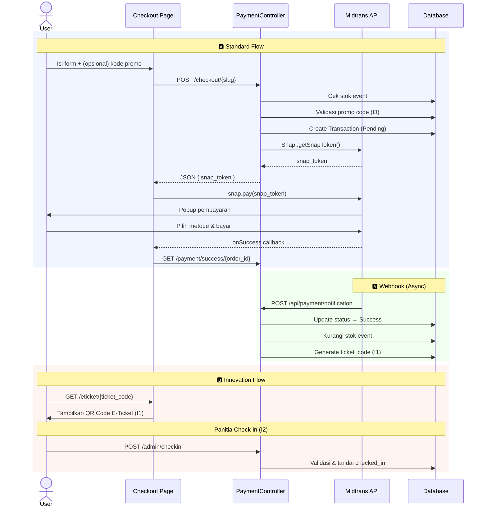

# Implementasi Payment Gateway Midtrans — EventHub

Mengintegrasikan **Midtrans Snap** ke EventHub agar checkout yang saat ini hanya **simulasi UI overlay** menjadi **payment gateway sungguhan**. Plan ini dibagi menjadi dua tier: **Fitur Standar (wajib)** dan **Fitur Inovasi (nilai tambah)**.

---

## 📋 Daftar Fitur

### 🅰️ Fitur Standar (Core Payment — Wajib Ada)

| # | Fitur | Deskripsi |
|---|-------|-----------|
| S1 | **Integrasi Midtrans Snap** | Install package, konfigurasi keys, generate Snap Token |
| S2 | **Checkout Flow** | Form → POST data → terima snap_token → popup Midtrans |
| S3 | **Webhook Notification** | Terima callback dari Midtrans, update status otomatis |
| S4 | **Halaman Sukses Pembayaran** | Konfirmasi setelah bayar berhasil dengan detail transaksi |
| S5 | **Database Transaction** | Model + migration lengkap (fillable, relasi, payment_type) |
| S6 | **Manajemen Transaksi Admin** | Halaman admin untuk lihat dan pantau semua transaksi |
| S7 | **Stok Otomatis Berkurang** | Stok event berkurang saat pembayaran berhasil (via webhook) |

### 🅱️ Fitur Inovasi (Nilai Tambah — Pembeda)

| # | Fitur | Deskripsi |
|---|-------|-----------|
| I1 | **🎫 QR Code E-Ticket** | Generate e-ticket dengan QR Code unik setelah bayar sukses, bisa di-download sebagai gambar |
| I2 | **✅ Sistem Check-in Tiket** | Halaman validasi tiket untuk panitia event — scan/input kode, tandai sudah hadir |
| I3 | **🏷️ Promo Code / Diskon** | Sistem kode promo yang bisa diinput saat checkout untuk mendapat potongan harga |
| I4 | **⏱️ Countdown Stok Real-time** | Badge stok dengan warna dinamis di halaman event detail ("Sisa 5 tiket!" berwarna merah) |
| I5 | **🔄 Auto-Expire Transaksi Pending** | Scheduled command yang otomatis expire-kan transaksi pending > 24 jam |

---

## User Review Required

> [!IMPORTANT]
> **Midtrans API Keys diperlukan.** Kamu perlu Server Key dan Client Key dari [Midtrans Sandbox Dashboard](https://dashboard.sandbox.midtrans.com/). Gratis untuk development.

> [!WARNING]
> **Webhook Lokal**: Midtrans mengirim notifikasi via HTTP POST. Di localhost, butuh **ngrok** agar Midtrans bisa reach server. Tanpa itu, status transaksi bisa diupdate manual dari admin panel sebagai fallback.

## Open Questions

1. **Sudah punya akun Midtrans Sandbox?** Jika belum, perlu register dulu.
2. **Biaya layanan Rp 5.000** — tetap digunakan atau dihapus?
3. **Fitur inovasi mana yang ingin diimplementasikan?** Semua 5 fitur, atau pilih beberapa saja?
4. **Apakah perlu quantity selector** (beli > 1 tiket) atau tetap 1 tiket per transaksi?

---

## 🅰️ Detail Fitur Standar

---

### S1. Integrasi Midtrans Snap — Package & Config

#### Install Package

```bash
composer require midtrans/midtrans-php
```

#### [NEW] [config/midtrans.php](file:///var/www/html/eventhub_3274/config/midtrans.php)

```php
return [
    'server_key'    => env('MIDTRANS_SERVER_KEY'),
    'client_key'    => env('MIDTRANS_CLIENT_KEY'),
    'is_production' => env('MIDTRANS_IS_PRODUCTION', false),
    'is_sanitized'  => env('MIDTRANS_IS_SANITIZED', true),
    'is_3ds'        => env('MIDTRANS_IS_3DS', true),
];
```

#### [MODIFY] [.env](file:///var/www/html/eventhub_3274/.env)

```diff
+MIDTRANS_SERVER_KEY=SB-Mid-server-xxxxxxxxxxxx
+MIDTRANS_CLIENT_KEY=SB-Mid-client-xxxxxxxxxxxx
+MIDTRANS_IS_PRODUCTION=false
+MIDTRANS_IS_SANITIZED=true
+MIDTRANS_IS_3DS=true
```

---

### S2. Checkout Flow — Frontend + Backend

#### [MODIFY] [checkout.blade.php](file:///var/www/html/eventhub_3274/resources/views/checkout.blade.php)

Perubahan:
1. **Hapus** seluruh overlay simulasi Midtrans (`#midtrans-overlay` + script `showMidtrans`/`hideMidtrans`)
2. **Tambah** Midtrans Snap.js CDN di bagian atas
3. **Tambah** `name` attribute pada setiap input field + CSRF meta tag
4. **Ganti** tombol "Bayar Sekarang" → AJAX POST yang:
   - Kirim data form (name, email, phone) ke `POST /checkout/{slug}`
   - Terima `snap_token` dari response JSON
   - Panggil `window.snap.pay(snap_token, { onSuccess, onPending, onError, onClose })`

```javascript
// Flow di frontend
payButton.addEventListener('click', async () => {
    const res = await fetch(`/checkout/${slug}`, {
        method: 'POST',
        headers: { 'X-CSRF-TOKEN': csrfToken, 'Content-Type': 'application/json' },
        body: JSON.stringify({ customer_name, customer_email, customer_phone })
    });
    const { snap_token } = await res.json();

    window.snap.pay(snap_token, {
        onSuccess: (r) => window.location = `/payment/success/${r.order_id}`,
        onPending: (r) => window.location = `/payment/success/${r.order_id}`,
        onError:   (r) => alert('Pembayaran gagal'),
        onClose:   ()  => alert('Popup ditutup, transaksi belum selesai')
    });
});
```

#### [MODIFY] [layouts/app.blade.php](file:///var/www/html/eventhub_3274/resources/views/layouts/app.blade.php)

Tambahkan CSRF meta tag di `<head>`:
```html
<meta name="csrf-token" content="{{ csrf_token() }}">
```

---

### S3. Webhook Notification Handler

#### [NEW] [routes/api.php](file:///var/www/html/eventhub_3274/routes/api.php)

```php
Route::post('/payment/notification', [PaymentController::class, 'callback']);
```

#### [MODIFY] [bootstrap/app.php](file:///var/www/html/eventhub_3274/bootstrap/app.php)

Register `api.php` sebagai route file:
```diff
 ->withRouting(
     web: __DIR__.'/../routes/web.php',
+    api: __DIR__.'/../routes/api.php',
     commands: __DIR__.'/../routes/console.php',
     health: '/up',
 )
```

Webhook menerima POST dari Midtrans dan memproses berdasarkan `transaction_status`:

| Midtrans Status | Status di DB | Aksi |
|-----------------|-------------|------|
| `capture` + `accept` | **Success** | Kurangi stok, generate ticket code |
| `settlement` | **Success** | Kurangi stok, generate ticket code |
| `pending` | **Pending** | — |
| `deny` / `cancel` / `expire` | **Expired** | — |

---

### S4. Halaman Sukses Pembayaran

#### [NEW] [payment-success.blade.php](file:///var/www/html/eventhub_3274/resources/views/payment-success.blade.php)

Halaman yang ditampilkan setelah pembayaran berhasil/pending:
- ✅ / ⏳ Status badge (Success / Pending)
- Detail transaksi: Order ID, nama, event, total bayar
- Jika sukses: tampilkan QR Code e-ticket (lihat fitur I1)
- Info email confirmation
- Tombol "Kembali ke Home" & "Lihat E-Ticket"

---

### S5. Database — Model & Migration

#### [NEW] Migration `add_payment_type_and_ticket_code_to_transactions`

```php
Schema::table('transactions', function (Blueprint $table) {
    $table->string('payment_type')->nullable()->after('status');
    $table->string('ticket_code')->unique()->nullable()->after('snap_token');
    $table->boolean('is_checked_in')->default(false)->after('ticket_code');
    $table->timestamp('checked_in_at')->nullable()->after('is_checked_in');
});
```

> [!NOTE]
> Kolom `ticket_code`, `is_checked_in`, `checked_in_at` sudah disiapkan untuk fitur inovasi I1 & I2 agar tidak perlu migration terpisah.

#### [MODIFY] [Transaction.php](file:///var/www/html/eventhub_3274/app/Models/Transaction.php)

```php
class Transaction extends Model
{
    protected $fillable = [
        'event_id', 'order_id', 'customer_name', 'customer_email',
        'customer_phone', 'total_price', 'status', 'snap_token',
        'payment_type', 'ticket_code', 'is_checked_in', 'checked_in_at',
    ];

    protected $casts = [
        'is_checked_in' => 'boolean',
        'checked_in_at' => 'datetime',
    ];

    public function event()
    {
        return $this->belongsTo(Event::class);
    }

    // Generate unique ticket code: EVT-XXXXX-XXXXX
    public static function generateTicketCode(): string
    {
        do {
            $code = 'EVT-' . strtoupper(Str::random(5)) . '-' . strtoupper(Str::random(5));
        } while (self::where('ticket_code', $code)->exists());
        return $code;
    }
}
```

---

### S6. PaymentController — Controller Utama

#### [NEW] [PaymentController.php](file:///var/www/html/eventhub_3274/app/Http/Controllers/PaymentController.php)

| Method | Route | Deskripsi |
|--------|-------|-----------|
| `process()` | `POST /checkout/{slug}` | Validasi → buat transaksi → generate snap token → return JSON |
| `callback()` | `POST /api/payment/notification` | Webhook handler — verifikasi signature, update status |
| `success()` | `GET /payment/success/{order_id}` | Tampilkan halaman sukses/pending |

**Detail `process()`:**
```
1. Validate: name, email, phone (required)
2. Find Event by slug
3. Check stock > 0
4. Generate unique order_id: "EH-{timestamp}-{random}"
5. Calculate total: event price + service fee
6. Create Transaction record (status: Pending)
7. Build Midtrans params (transaction_details, customer_details, item_details)
8. Call Midtrans\Snap::getSnapToken($params)
9. Save snap_token to transaction
10. Return JSON { snap_token, order_id }
```

**Detail `callback()`:**
```
1. Create Midtrans\Notification object
2. Verify signature: SHA512(order_id + status_code + gross_amount + server_key)
3. Find transaction by order_id
4. Map transaction_status → internal status
5. If Success: update status, set payment_type, generate ticket_code, decrement event stock
6. If Expired/Cancelled: update status only
```

---

### S7. Routes Update

#### [MODIFY] [web.php](file:///var/www/html/eventhub_3274/routes/web.php)

```diff
+use App\Http\Controllers\PaymentController;

 Route::get('/checkout/{slug}', [EventController::class, 'checkout'])->name('checkout');
+Route::post('/checkout/{slug}', [PaymentController::class, 'process'])->name('checkout.process');
+Route::get('/payment/success/{order_id}', [PaymentController::class, 'success'])->name('payment.success');
```

---

## 🅱️ Detail Fitur Inovasi

---

### I1. 🎫 QR Code E-Ticket

**Konsep:** Setelah pembayaran sukses, sistem generate QR Code berisi `ticket_code` unik. User bisa lihat dan download e-ticket langsung dari halaman sukses.

#### Implementasi

**Package:** `simplesoftwareio/simple-qrcode` (Laravel QR Code generator)

```bash
composer require simplesoftwareio/simple-qrcode
```

**Flow:**
```
Payment Success → ticket_code sudah di-generate oleh webhook
→ Halaman success menampilkan QR Code dari ticket_code
→ QR berisi: "EVT-ABCDE-FGHIJ" (bisa di-scan oleh panitia)
→ Tombol "Download E-Ticket" → generate gambar tiket lengkap
```

#### [NEW] [EticketController.php](file:///var/www/html/eventhub_3274/app/Http/Controllers/EticketController.php)

| Method | Route | Deskripsi |
|--------|-------|-----------|
| `show()` | `GET /eticket/{ticket_code}` | Tampilkan halaman e-ticket dengan QR Code |
| `download()` | `GET /eticket/{ticket_code}/download` | Download e-ticket sebagai gambar/PDF |

#### [NEW] [eticket.blade.php](file:///var/www/html/eventhub_3274/resources/views/eticket.blade.php)

Desain e-ticket premium yang menampilkan:
- 🎫 Header dengan branding EventHub
- Nama event, tanggal, lokasi
- Nama pemesan + Order ID
- **QR Code besar** di tengah
- Ticket code text di bawah QR
- Footer: "Tunjukkan QR Code ini saat masuk"

---

### I2. ✅ Sistem Check-in Tiket

**Konsep:** Panitia event bisa memvalidasi tiket peserta dengan memasukkan kode tiket di halaman check-in. Sistem menandai tiket sudah digunakan agar tidak bisa double-entry.

#### Implementasi

#### [NEW] [CheckinController.php](file:///var/www/html/eventhub_3274/app/Http/Controllers/Admin/CheckinController.php)

| Method | Route | Deskripsi |
|--------|-------|-----------|
| `index()` | `GET /admin/checkin` | Halaman form input kode tiket |
| `verify()` | `POST /admin/checkin` | Validasi kode → tandai `is_checked_in = true` |

**Validasi logic:**
```
1. Cari transaction by ticket_code
2. Cek status == "Success" → jika bukan: "Tiket belum dibayar"
3. Cek is_checked_in == false → jika true: "Tiket sudah digunakan pada {checked_in_at}"
4. Jika valid: update is_checked_in = true, checked_in_at = now()
5. Tampilkan: ✅ "Check-in berhasil untuk {customer_name} — Event: {event_title}"
```

#### [NEW] [admin/checkin.blade.php](file:///var/www/html/eventhub_3274/resources/views/admin/checkin.blade.php)

UI dengan:
- Input field besar untuk ketik/scan kode tiket
- Tombol "Verifikasi"
- Area hasil: sukses (hijau), gagal (merah), sudah digunakan (kuning)
- Counter: "Total Check-in: X / Y tiket terjual"

---

### I3. 🏷️ Promo Code / Diskon

**Konsep:** Admin bisa membuat kode promo dengan nominal atau persentase diskon. User memasukkan kode di halaman checkout untuk mendapat potongan harga.

#### Database

#### [NEW] Migration `create_promo_codes_table`

```php
Schema::create('promo_codes', function (Blueprint $table) {
    $table->id();
    $table->string('code')->unique();           // "AMIKOM50"
    $table->enum('type', ['fixed', 'percent']); // fixed = Rp, percent = %
    $table->integer('value');                    // 50000 atau 20
    $table->integer('max_uses')->default(0);     // 0 = unlimited
    $table->integer('used_count')->default(0);
    $table->dateTime('valid_until')->nullable();
    $table->boolean('is_active')->default(true);
    $table->timestamps();
});
```

#### [NEW] Migration `add_promo_fields_to_transactions`

```php
Schema::table('transactions', function (Blueprint $table) {
    $table->string('promo_code')->nullable()->after('total_price');
    $table->integer('discount_amount')->default(0)->after('promo_code');
});
```

#### [NEW] [PromoCode.php](file:///var/www/html/eventhub_3274/app/Models/PromoCode.php) — Model

#### [MODIFY] [checkout.blade.php](file:///var/www/html/eventhub_3274/resources/views/checkout.blade.php)

Tambahkan di form checkout:
- Input field "Punya kode promo?"
- Tombol "Terapkan" → AJAX `POST /promo/validate`
- Tampilkan diskon & total baru secara real-time

#### Routes Tambahan

```php
Route::post('/promo/validate', [PaymentController::class, 'validatePromo'])->name('promo.validate');
```

#### Admin CRUD

```php
Route::resource('admin/promo-codes', PromoCodeController::class);
```

---

### I4. ⏱️ Countdown Stok Real-time

**Konsep:** Di halaman event detail, tampilkan badge stok yang berubah warna berdasarkan sisa stok. Memberikan urgency kepada calon pembeli.

#### [MODIFY] [event-detail.blade.php](file:///var/www/html/eventhub_3274/resources/views/event-detail.blade.php)

Logika warna badge:

| Sisa Stok | Warna | Label |
|-----------|-------|-------|
| > 50 | 🟢 Hijau | "Tersedia: {n} tiket" |
| 11–50 | 🟡 Kuning | "Segera habis! Sisa {n} tiket" |
| 1–10 | 🔴 Merah + Animasi pulse | "🔥 Hampir habis! Sisa {n} tiket!" |
| 0 | ⚫ Abu-abu | "SOLD OUT" + disable tombol pesan |

Tambahkan juga di **event card** pada homepage dan katalog agar user langsung melihat urgency.

#### [MODIFY] [welcome.blade.php](file:///var/www/html/eventhub_3274/resources/views/welcome.blade.php)

Badge kecil di pojok kanan atas card event yang menunjukkan sisa stok.

#### [MODIFY] [katalog.blade.php](file:///var/www/html/eventhub_3274/resources/views/katalog.blade.php)

Sama seperti welcome — tampilkan badge stok di setiap card.

---

### I5. 🔄 Auto-Expire Transaksi Pending

**Konsep:** Transaksi dengan status "Pending" yang sudah lewat 24 jam otomatis diubah menjadi "Expired" oleh scheduled command. Ini mencegah stok "terkunci" oleh transaksi yang tidak diselesaikan.

#### [NEW] [ExpirePendingTransactions.php](file:///var/www/html/eventhub_3274/app/Console/Commands/ExpirePendingTransactions.php)

```php
class ExpirePendingTransactions extends Command
{
    protected $signature = 'transactions:expire-pending';
    protected $description = 'Expire transaksi pending yang lebih dari 24 jam';

    public function handle()
    {
        $expired = Transaction::where('status', 'Pending')
            ->where('created_at', '<', now()->subHours(24))
            ->update(['status' => 'Expired']);

        $this->info("Expired {$expired} pending transactions.");
    }
}
```

#### [MODIFY] [routes/console.php](file:///var/www/html/eventhub_3274/routes/console.php)

```php
Schedule::command('transactions:expire-pending')->hourly();
```

---

## Arsitektur Flow Keseluruhan



---

## Ringkasan Semua File

### File Baru

| File | Fitur | Deskripsi |
|------|-------|-----------|
| `config/midtrans.php` | S1 | Konfigurasi Midtrans |
| `routes/api.php` | S3 | Route webhook |
| `app/Http/Controllers/PaymentController.php` | S2, S3, S4 | Controller utama payment |
| `resources/views/payment-success.blade.php` | S4 | Halaman sukses |
| `database/migrations/xxx_add_fields_to_transactions.php` | S5 | Kolom baru transaksi |
| `app/Http/Controllers/EticketController.php` | I1 | Controller e-ticket |
| `resources/views/eticket.blade.php` | I1 | Halaman e-ticket + QR |
| `app/Http/Controllers/Admin/CheckinController.php` | I2 | Controller check-in |
| `resources/views/admin/checkin.blade.php` | I2 | Halaman check-in panitia |
| `app/Models/PromoCode.php` | I3 | Model promo code |
| `database/migrations/xxx_create_promo_codes_table.php` | I3 | Tabel promo codes |
| `database/migrations/xxx_add_promo_to_transactions.php` | I3 | Kolom promo di transaksi |
| `app/Http/Controllers/Admin/PromoCodeController.php` | I3 | CRUD promo code admin |
| `resources/views/admin/promo-codes/*.blade.php` | I3 | Views CRUD promo |
| `app/Console/Commands/ExpirePendingTransactions.php` | I5 | Command auto-expire |

### File yang Dimodifikasi

| File | Fitur | Perubahan |
|------|-------|-----------|
| `.env` | S1 | Tambah Midtrans keys |
| `composer.json` | S1, I1 | Tambah package midtrans + qrcode |
| `bootstrap/app.php` | S3 | Register api.php route |
| `app/Models/Transaction.php` | S5 | Fillable, relasi, casts, helpers |
| `routes/web.php` | S2, S7, I1, I2, I3 | Tambah routes baru |
| `routes/console.php` | I5 | Schedule command |
| `resources/views/layouts/app.blade.php` | S2 | CSRF meta tag + Snap.js CDN |
| `resources/views/checkout.blade.php` | S2, I3 | Integrasi Snap.js, promo input, hapus overlay simulasi |
| `resources/views/event-detail.blade.php` | I4 | Badge stok dinamis |
| `resources/views/welcome.blade.php` | I4 | Badge stok di card event |
| `resources/views/katalog.blade.php` | I4 | Badge stok di card event |

---

## Verification Plan

### Automated Tests
```bash
composer require midtrans/midtrans-php
# (dan simplesoftwareio/simple-qrcode jika I1 disetujui)
php artisan migrate
php artisan config:clear
php artisan serve
```

### Manual Verification
1. **Checkout Flow**: Buka event → checkout → isi form → klik bayar → popup Midtrans muncul
2. **Test Payment** (Sandbox):
   - Kartu: `4811 1111 1111 1114`, CVV `123`, Exp any future date
   - GoPay: otomatis approve di sandbox
3. **Database**: Pastikan record transaksi tersimpan dengan `snap_token`, `status`, `ticket_code`
4. **Halaman Sukses**: Redirect ke halaman sukses dengan detail + QR Code
5. **E-Ticket**: Buka `/eticket/{code}` → tampilkan QR Code, test download
6. **Check-in**: Masuk `/admin/checkin` → input kode → verifikasi berhasil/gagal
7. **Promo**: Input kode promo → harga terupdate → total bayar berkurang
8. **Stok Badge**: Cek warna badge berubah sesuai sisa stok (edit stok event via admin)
9. **Auto-Expire**: Jalankan `php artisan transactions:expire-pending` → transaksi pending lama jadi Expired
10. **Admin Panel**: Semua transaksi muncul di `/admin/transactions` dengan status benar

### Urutan Implementasi

```
S1 (Config) → S5 (Database) → S6 (PaymentController) → S2 (Checkout UI)
→ S3 (Webhook) → S4 (Success Page) → S7 (Stok)
→ I1 (E-Ticket) → I2 (Check-in) → I4 (Stok Badge) → I3 (Promo) → I5 (Auto-Expire)
```
